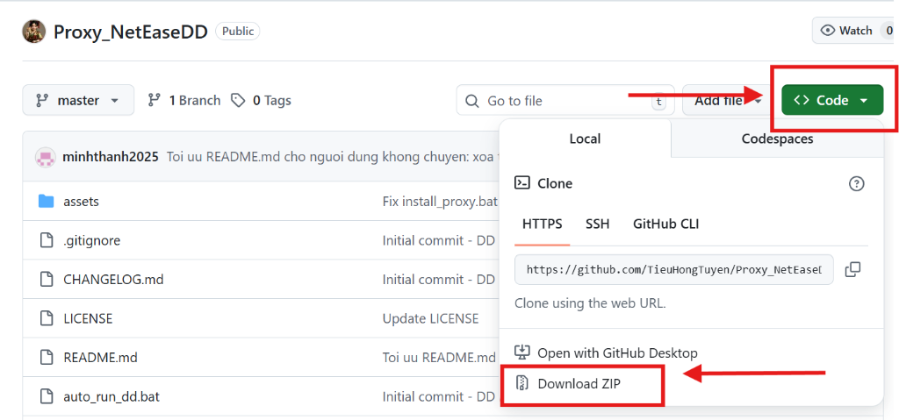
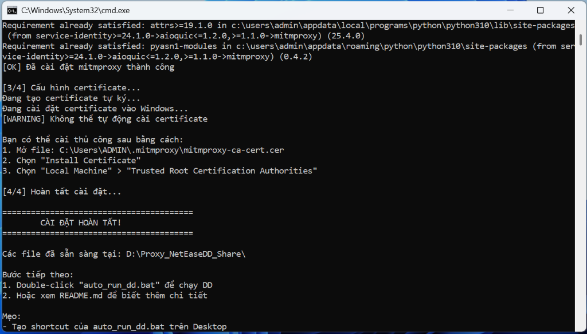

# 🚀 DD Proxy - Công Cụ Proxy Đơn Giản Cho Phần Mềm DD

> **Giải pháp proxy nhẹ, tự động - Dành cho người không biết lập trình!**

[](LICENSE)
[](https://www.microsoft.com/windows)
[](https://www.python.org/)

---

- [Proxy là gì? Tại sao cần dùng?](#-proxy-là-gì-tại-sao-cần-dùng)
- [Bắt đầu nhanh trong 3 bước](#-bắt-đầu-nhanh-trong-3-bước)
- [Câu hỏi thường gặp (FAQ)](#-câu-hỏi-thường-gặp-faq)
- [Xử lý sự cố](#-xử-lý-sự-cố)
- [Cấu hình nâng cao](#-cấu-hình-nâng-cao)

---

## 🤔 Proxy là gì? Tại sao cần dùng?

### Giải thích đơn giản

**Proxy** giống như một "người trung gian" giữa phần mềm DD và Internet:

```
Phần mềm DD → Proxy (127.0.0.1:8888) → Internet
```

### Tại sao phần mềm DD cần proxy?

Phần mềm DD cần proxy để:
- ✅ Load được giao diện chính xác
- ✅ Kết nối được với server
- ✅ Hoạt động ổn định

### DD Proxy giúp gì?

DD Proxy:
- 🎯 **Tự động**: 1 click là chạy
- ⚡ **Nhẹ**: Chỉ ~50MB RAM
- 🔄 **Thông minh**: Tự động tắt khi đóng DD
- 💚 **Miễn phí**: Hoàn toàn miễn phí, mã nguồn mở

---

## ⚡ Bắt Đầu Nhanh Trong 3 Bước

### Bước 1️⃣: Cài đặt (Chỉ làm 1 lần)

1. **Tải Python** (nếu chưa có):
   - Vào: https://www.python.org/downloads/
   - Tải phiên bản mới nhất
   - **QUAN TRỌNG**: Khi cài, tích ✅ vào "Add Python to PATH"

2. **Kiểm tra Python** (Quan trọng):
   - Mở CMD (nhấn phím Windows + R, gõ `cmd` rồi Enter)
   - Gõ lệnh: `python --version`
   - Nếu hiện: `Python 3.x.x` là bạn đã cài đúng.
   - **Nếu hiện lỗi "command not found" hoặc nhảy vào Microsoft Store**: Xem mục [Xử lý sự cố](#-xử-lý-sự-cố) bên dưới.

3. **Tải và Cài đặt DD Proxy**:
   - Nhấn vào nút **Code** (màu xanh) -> Chọn **Download ZIP**.
   - Giải nén file vừa tải về.
   - Nhấn chuột phải vào `install_proxy.bat` trong thư mục vừa giải nén.
   - Chọn **"Run as administrator"**.
   - Đợi cài đặt hoàn tất (2-3 phút).



> [!IMPORTANT]
> **Bước 3/4: Cấu hình Certificate có thể cần làm thủ công**
> Nếu bạn thấy thông báo `[WARNING] Không thể tự động cài certificate`, hãy làm theo các bước sau:
> 1. Mở thư mục: `%USERPROFILE%\.mitmproxy` (copy và dán vào thanh địa chỉ File Explorer)
> 2. Mở file: `mitmproxy-ca-cert.cer`
> 3. Chọn **"Install Certificate..."**
> 4. Chọn **"Local Machine"** -> Next
> 5. Chọn **"Place all certificates in the following store"**
> 6. Nhấn **Browse...** và chọn **"Trusted Root Certification Authorities"**
> 7. Nhấn **OK** -> **Next** -> **Finish**
>
> 

### Bước 2️⃣: Chạy phần mềm DD

Double-click file này:
```
auto_run_dd.bat
```

**Xong!** Phần mềm DD sẽ tự động mở và hoạt động bình thường.

### Bước 3️⃣: Sử dụng hàng ngày

Mỗi khi muốn dùng phần mềm DD, bạn chỉ cần:
1. Double-click `auto_run_dd.bat`
2. Sử dụng DD bình thường.
3. Khi xong, chỉ cần đóng phần mềm DD → Proxy sẽ tự động tắt sạch sẽ!

---

### ⚙️ Thay Đổi Đường Dẫn DD (Nếu cần)

Mặc định công cụ tìm DD tại: `D:\NetEaseDD\Start.exe`. Nếu bạn cài ở chỗ khác:
1. Nhấn chuột phải vào `auto_run_dd.bat` chọn **Edit** (hoặc mở bằng Notepad).
2. Tìm dòng: `set "DD_PATH=D:\NetEaseDD\Start.exe"` và sửa lại đúng đường dẫn.
3. Lưu lại là xong.

---

<removed>
## 💡 Mẹo Sử Dụng

### 🖱️ Tạo Shortcut Trên Desktop

1. Nhấn chuột phải vào `auto_run_dd.bat`
2. Chọn **"Create shortcut"**
3. Kéo shortcut ra Desktop
4. Đổi tên thành **"🚀 Chạy DD"**

<removed>
---

## ❓ Câu Hỏi Thường Gặp (FAQ)

### Q1: Tôi không biết gì về lập trình, có dùng được không?

**A:** Hoàn toàn được! Chỉ cần:
1. Cài Python (tích "Add to PATH")
2. Chạy `install_proxy.bat` (chuột phải → Run as administrator)
3. Sau đó chỉ cần double-click `auto_run_dd.bat` mỗi khi dùng

### Q2: Tại sao phải cài Python?

**A:** DD Proxy được viết bằng Python. Python là ngôn ngữ lập trình miễn phí, an toàn, được hàng triệu người dùng trên thế giới.

### Q3: Có mất tiền không?

**A:** Hoàn toàn MIỄN PHÍ! Cả Python và DD Proxy đều miễn phí 100%.

### Q4: Có an toàn không?

**A:** Có! DD Proxy:
- ✅ Chỉ chạy trên máy bạn (127.0.0.1)
- ✅ Không gửi dữ liệu ra ngoài
- ✅ Mã nguồn mở, ai cũng có thể xem
- ✅ Không cài đặt gì vào hệ thống (trừ Python)

### Q5: Có gì nổi bật hơn các công cụ khác?

**A:** DD Proxy cực kỳ nhẹ (~50MB RAM), tự động bật/tắt hoàn toàn theo phần mềm DD và cực kỳ dễ sử dụng cho người mới.

### Q6: Proxy có ảnh hưởng đến tốc độ mạng không?

**A:** Không đáng kể. DD Proxy rất nhẹ và chỉ xử lý traffic của DD.

### Q7: Tôi có thể dùng cho nhiều máy không?

**A:** Có! Copy toàn bộ thư mục sang máy khác, chạy lại `install_proxy.bat`.

### Q8: Làm sao biết proxy đang chạy?

**A:** Chạy `check_proxy_status.bat` để xem trạng thái.

---

## 🐛 Xử Lý Sự Cố

### ❌ Lỗi: "Python không được cài đặt" hoặc gõ `python --version` không ra kết quả

**Nguyên nhân:** Chưa cài Python, chưa thêm vào PATH, hoặc bị Windows Alias chặn.

**Giải pháp:**
1. Tải Python: https://www.python.org/downloads/
2. Khi cài, **PHẢI TÍCH** ✅ "Add Python to PATH"
3. Nếu vẫn không nhận lệnh `python` sau khi cài, thử **tắt Windows alias**:
   - Vào **Settings** → **Apps** → **Advanced app settings** → **App execution aliases**
   - Tìm và gõ **Tắt (OFF)** các mục:
     - `App Installer - python.exe`
     - `App Installer - python3.exe`
4. Cài đặt xong, chạy lại `install_proxy.bat`

### ❌ Lỗi: "Không thể khởi động proxy"

**Nguyên nhân:** Port 8888 đã được dùng bởi chương trình khác

**Giải pháp:**
```batch
# Kiểm tra port 8888
netstat -ano | findstr :8888

# Nếu có chương trình khác, tắt nó hoặc đổi port trong dd_proxy.py
```

### ❌ Lỗi: "DD không load giao diện"

**Nguyên nhân:** Proxy chưa chạy hoặc Windows proxy chưa bật

**Giải pháp:**
```batch
# 1. Kiểm tra trạng thái
check_proxy_status.bat

# 2. Nếu proxy chưa chạy
start_dd_proxy.bat

# 3. Bật Windows proxy thủ công trong Cài đặt Windows nếu cần
# 4. Mở lại DD
```

### ❌ Lỗi: "Access Denied" khi cài đặt

**Nguyên nhân:** Chưa chạy với quyền Administrator

**Giải pháp:**
- Nhấn chuột phải vào `install_proxy.bat`
- Chọn **"Run as administrator"**

### ❌ DD chạy chậm hoặc lag

**Nguyên nhân:** Có thể do proxy hoặc mạng

**Giải pháp:**
1. Kiểm tra kết nối Internet
2. Khởi động lại proxy:
   ```batch
   stop_dd_proxy.bat
   start_dd_proxy.bat
   ```
3. Khởi động lại DD

### ❌ Lỗi Cache / Certificate / Không load được giao diện

**Dấu hiệu:** Proxy đã bật nhưng DD vẫn không kết nối được, hoặc bạn nhận được cảnh báo về Certificate.

**Giải pháp:**
1. Chạy lại `install_proxy.bat`.
2. Khi chương trình hỏi `Bạn có muốn xóa cache/certificate cũ không? (y/N):`, hãy gõ **y** rồi Enter.
3. Sau đó tiến hành cài đặt lại như bình thường. Việc này sẽ xóa sạch các cấu hình cũ bị lỗi và tạo mới.

### ❓ Tại sao file .bat tự thoát ngay khi mở?

**Nguyên nhân:** Thường do bạn chạy file trực tiếp trong file nén (.zip) mà chưa giải nén, hoặc đường dẫn thư mục có ký tự lạ.

**Giải pháp:**
1. **Giải nén** hoàn toàn file ZIP tải từ GitHub về một thư mục (ví dụ: `D:\Proxy_NetEaseDD`).
2. Không để thư mục ở nơi có tên tiếng Việt có dấu hoặc ký tự đặc biệt nếu có thể.
3. Đảm bảo đã cài Python và tích vào "Add Python to PATH".

---

## 🛠️ Cấu Hình Nâng Cao

### Thay Đổi Port Proxy

Mặc định: `8888`

Để đổi sang port khác (ví dụ: `9999`):

1. Mở `dd_proxy.py`, tìm dòng:
   ```python
   listen_port=8888,
   ```
   Sửa thành:
   ```python
   listen_port=9999,
   ```

2. Mở tất cả file `.bat`, tìm `8888` và thay bằng `9999`

3. Lưu lại và chạy lại `install_proxy.bat`

---

## 📞 Hỗ Trợ

### Cần Giúp Đỡ?

1. **Xem FAQ** ở trên
2. **Chạy** `check_proxy_status.bat` để kiểm tra
3. **Xem log**: `dd_proxy.log`
4. **Mở Issue** trên GitHub: [Tạo Issue](../../issues)

### Báo Lỗi

Khi báo lỗi, vui lòng cung cấp:
- [ ] Phiên bản Windows (Win 10/11)
- [ ] Phiên bản Python (`python --version`)
- [ ] Nội dung file `dd_proxy.log` (10 dòng cuối)
- [ ] Mô tả chi tiết lỗi

---

## 🤝 Đóng Góp

Dự án này là mã nguồn mở! Mọi đóng góp đều được chào đón:

- 🐛 Báo lỗi (Issues)
- 💡 Đề xuất tính năng
- 📝 Cải thiện tài liệu
- 🔧 Gửi Pull Request

---

## 📜 Giấy Phép

Dự án này sử dụng [MIT License](LICENSE) - Bạn có thể tự do sử dụng, sửa đổi, và chia sẻ.

---

## 🎉 Lời Cảm Ơn

Cảm ơn bạn đã sử dụng DD Proxy! Nếu thấy hữu ích, hãy:
- ⭐ Star dự án trên GitHub
- 📢 Chia sẻ cho bạn bè
- 💬 Để lại feedback

---

**Phiên bản**: 2.2
**Cập nhật**: 2026-01-31  
**Tương thích**: Windows 10/11, Python 3.7+  
**Tác giả**: Tiểu Hồng Tuyến (Tiktok)

**Chúc bạn sử dụng vui vẻ!** 🎉🚀
